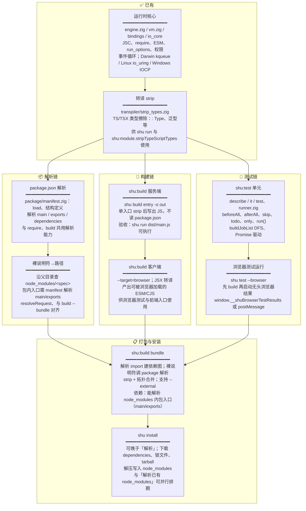

# ShuJS

> ⚡ **ShuJS** 是基于 **Zig** 与 **JavaScriptCore** 构建的新一代 JS/TS
> 运行时。利用 Zig 的零成本抽象，在 JSC 引擎之上重建了高并发、高吞吐量的高性能
> IO 层，面向大数据与大模型服务等场景，旨在实现对 **Node**、**Deno** 和 **Bun**
> API 的全量原生兼容，追求极致的启动速度与安全受控的内存表现。
>
> **目标**：全面兼容
> Node、Deno、Bun，最终能够**直接运行**三者的项目（无需改写即可用 `shu run` 替代
> `node` / `deno` / `bun` 执行）。

---

## 📑 目录

- [能力与计划一览（按顺序）](#-能力与计划一览按顺序)
- [🗓️ 开发计划（整体顺序）](#️-开发计划整体顺序)
- [📁 src 目录开发计划时序](#-src-目录开发计划时序)
- [⌨️ CLI 实用命令分析](#️-cli-实用命令分析)
- [🔧 构建与运行](#-构建与运行)

---

## 🗓️ 开发计划（整体顺序）

以下按**依赖关系**与**价值优先级**排列：先做能解锁后续能力的基础项，再做依赖前者的功能。
**build 要做完整，必须先处理好 package.json
与依赖解析**（见下方依赖图与阶段说明）。

### 🔗 一、整体依赖关系



- [ ] **build 单文件**（服务端/客户端）：只读入口做 strip/JSX，**不依赖**
      package.json。
- [ ] **build --bundle**：解析 `import 'lodash'` 等裸说明符时，必须把 `'lodash'`
      解析到 `node_modules/lodash/` 下真实入口文件，需要读各包的
      **package.json（main、exports）**，故 **build --bundle 依赖 package
      的「package.json 解析 + 裸说明符→文件路径」**。运行时 `require` 已能从已有
      node_modules 向上查找目录，但包内入口（main/exports）的解析需在
      **package/manifest** 中补全并与 build 共用。
- [ ] **shu install**：负责下载依赖并写入 node_modules，与「从已存在的
      node_modules 解析路径」是两件事；build 可先依赖「解析已有
      node_modules」（用户可能已用 npm install），**install
      可排在「解析能力」之后或并行**。

---

## 📋 能力与计划一览（按顺序）

以下为**已完成 [x]** 与**未完成 [ ]** 项，按逻辑顺序统一排列。

---

### 🖥️ 一、CLI 与入口

| 状态 | 项目                      | 说明                                                                                                                                                                                      |
| :--: | ------------------------- | ----------------------------------------------------------------------------------------------------------------------------------------------------------------------------------------- |
| [x]  | **main.zig**              | CLI 入口，解析子命令并分发到 run / install / build / test / check / lint / fmt                                                                                                            |
| [x]  | **shu run &lt;entry&gt;** | 执行单文件 .js / .ts / .tsx；TS/TSX 自动类型擦除后执行；支持 --allow-net、--allow-read、--allow-env、--allow-write、--allow-exec、--lang                                                  |
| [x]  | **cli/args.zig**          | 全局参数解析（权限、help 等）                                                                                                                                                             |
| [x]  | **shu install**           | 安装依赖到 node_modules：npm + JSR 解析、lockfile（shu.lock）、并行解析（A）、并行安装（B）、lockfile 一致时跳过解析（C）、解析阶段存 tarball_url 免重复请求（D）、JSR 16 worker 并行安装 |
| [ ]  | **其他子命令**            | build、test、check、lint、fmt 已注册；**test** 已实现发现与执行（shu 模块单元测试为主），待补 node/deno/bun 兼容测试与 --browser；build 部分实现，其余为占位                                                                                     |

---

### 🔄 二、转译与模块解析

| 状态 | 项目                           | 说明                                                                                                                                                                                 |
| :--: | ------------------------------ | ------------------------------------------------------------------------------------------------------------------------------------------------------------------------------------ |
| [x]  | **transpiler/strip_types.zig** | TS/TSX 类型擦除（`: Type`、`) : Type`、泛型等），供 run 与 shu:module.stripTypeScriptTypes 使用                                                                                      |
| [ ]  | **transpiler/ts.zig**          | 完整 TS 转译占位；jsx.zig 占位                                                                                                                                                       |
| [x]  | **require**                    | CJS：`require(id)`、`module`、`exports`、`__dirname`、`__filename`；相对路径与裸说明符解析，沿目录向上查 `node_modules/<specifier>`；模块缓存；node:/shu:/bun:/deno: 等 builtin 解析 |
| [x]  | **esm_loader**                 | ESM：import/export 解析、依赖图构建、拓扑执行、shu:/node: 等说明符解析；.mjs/.mts 入口走 ESM                                                                                         |
| [x]  | **shu:module**                 | builtinModules、createRequire、isBuiltin、findPackageJSON、**stripTypeScriptTypes**（运行时擦除 TS 类型）                                                                            |

---

### ⚙️ 三、运行时核心

| 状态 | 项目                         | 说明                                                                                                                                                                    |
| :--: | ---------------------------- | ----------------------------------------------------------------------------------------------------------------------------------------------------------------------- |
| [x]  | **engine.zig**               | JSC 生命周期（group、global context）、runAsModule / runAsEsmModule；定时器事件循环（setTimeout/setInterval/setImmediate/queueMicrotask）                               |
| [x]  | **vm.zig**                   | VM 封装、run(source, entry_path) 按入口扩展名走 ESM 或 CJS                                                                                                              |
| [x]  | **bindings**                 | 全局 API 注册（console、定时器、fetch、process、**dirname/**filename、Shu._、Buffer、require、Bun._、node:\* 等）                                                       |
| [x]  | **run_options / permission** | 工作目录、argv、权限（allow_net/read/env/write/exec）、locale、is_forked                                                                                                |
| [x]  | **io_core**                  | 高并发 I/O：Darwin（kqueue）、Linux（io_uring）、Windows（IOCP）；ChunkAllocator、ThreadLocalChunkCache；SIMD 头部扫描（indexOfCrLfCrLf）；零拷贝解析与全链路不复制头部 |
| [x]  | **JSC 边界安全与稳定性**     | 对 GetProperty/arguments 取值先 JSValueToObject 或 undefined/null 检查再 JSObjectIsFunction/Call，避免 tagged 值当指针导致段错误（zlib、dns、net、fs、server、async、perf_hooks 等）；net 模块 host/path 所有权（host_owned/path_owned）仅对 allocator 分配内存 free，避免对字面量 free 导致 Bus error |

---

### 📦 四、内置模块（shu:xxx，Zig 实现）

以下模块已实现并可 `require('shu:xxx')` 或
`import from 'shu:xxx'`（部分为占位或子集）。近期：抛错与回调等由内联 JS 改为纯 Zig 实现（assert、url、encoding、crypto、http、stubs 等）；JSC 取值处统一先 ToObject/undefined 检查再作函数调用，避免段错误；net 模块 host/path 所有权明确，仅对分配内存 free。

| 状态 | 项目           | 说明                                                                                                                                                                                                                                                                                                                                                               |
| :--: | -------------- | ------------------------------------------------------------------------------------------------------------------------------------------------------------------------------------------------------------------------------------------------------------------------------------------------------------------------------------------------------------------ |
| [x]  | **文件与路径** | `shu:fs`（Shu.fs：read/write/readdir/mkdir/stat/…）、`shu:path`（join/resolve/dirname/basename/extname/normalize 等）                                                                                                                                                                                                                                              |
| [x]  | **网络与 I/O** | `shu:server`（HTTP/1.1、HTTP/2、TLS、WebSocket、压缩、keep-alive）、shu:http、shu:https、shu:net、shu:tls、shu:dgram、shu:dns、全局 fetch、WebSocket 客户端                                                                                                                                                                                                        |
| [x]  | **系统与进程** | `shu:process`、`shu:system`（exec/run/spawn/fork）、`shu:threads`、shu:os、shu:buffer、shu:stream                                                                                                                                                                                                                                                                  |
| [x]  | **工具与兼容** | shu:assert、shu:events、shu:util、shu:querystring、shu:url、shu:string_decoder、shu:console、shu:timers、shu:crypto、shu:zlib、shu:encoding、shu:readline、shu:vm、shu:async_hooks、shu:perf_hooks、shu:diagnostics_channel、shu:report、shu:inspector、shu:tty、shu:permissions、shu:intl、shu:webcrypto、shu:webstreams、shu:cluster、shu:debugger、shu:crond 等 |
| [x]  | **Node 兼容**  | `node:` 内置已基本写全，与 `shu:` 一一对应；仅 node:repl、node:test、node:wasi、node:v8、node:punycode、node:domain 为占位。详见 `src/runtime/modules/node/builtin.zig`、`src/runtime/engine/BUILTINS.md`                                                                                                                                                          |

---

### 🧪 五、测试运行器（shu:test）

| 状态 | 项目                                              | 说明                                                                                                 |
| :--: | ------------------------------------------------- | ---------------------------------------------------------------------------------------------------- |
| [x]  | **describe / it / test**                          | 注册 suite 与用例；支持 name、fn、options（第三参）                                                  |
| [x]  | **beforeAll / afterAll / beforeEach / afterEach** | 钩子注册与执行顺序                                                                                   |
| [x]  | **skip / skipIf / todo / only**                   | 跳过、条件跳过、占位用例、仅跑该用例                                                                 |
| [x]  | **run()**                                         | 返回 Promise，纯 Zig 驱动任务队列与 Promise 链；advance、reject 挂到 globalThis                      |
| [x]  | **runner.zig**                                    | Suite/TestEntry 树、Job 队列、buildJobList（DFS、has_only 过滤）                                     |
| [x]  | **shu test CLI 与 shu 模块单元测试（部分）**      | CLI 已支持发现并执行测试（`shu test` / `shu test -A`）；`tests/unit/shu/` 下已有约 39 个 shu 模块单元测试（assert、buffer、server、net、fs、crypto、timers 等），部分用例已跑通 |
| [ ]  | **兼容测试全覆盖（shu / node / deno / bun）**     | 测试需**分配并覆盖**四类命名空间与风格：**shu:** 内置、**node:** 兼容、**Deno** 风格 API（如 Deno.test、Deno.readFile）、**Bun** 风格 API；每类需有独立或共享的兼容用例，保证与 Node/Deno/Bun 行为对齐 |
| [ ]  | **浏览器测试**                                    | `shu test --browser` 与 CLI 测试发现尚未实现；详见 `src/runtime/modules/shu/test/BROWSER_TESTING.md` |

---

### 📋 六、包与解析（部分）

| 状态 | 项目                       | 说明                                                                                                                        |
| :--: | -------------------------- | --------------------------------------------------------------------------------------------------------------------------- |
| [x]  | **package/manifest.zig**   | package.json 结构定义与 load，供 install 与 require 使用                                                                    |
| [x]  | **package/resolver.zig**   | 依赖解析（npm/JSR 说明符、lockfile、解析与安装流程）                                                                        |
| [x]  | **package/install.zig**    | 完整 install：lockfile、npm 并行解析（16 worker）与并行安装（16 worker）、JSR 并行安装（16 worker）、tarball 缓存、优化 C/D |
| [x]  | **require resolveRequest** | 相对路径解析；裸说明符沿父目录查 node_modules；包内 main/exports 由 manifest 解析，与 build --bundle 共用                   |

---

### 📄 七、文档与构建

| 状态 | 项目               | 说明                                                                                                    |
| :--: | ------------------ | ------------------------------------------------------------------------------------------------------- |
| [x]  | **build.zig**      | Zig 构建；JSC 链接（macOS 系统框架，Linux/Windows 需 -Djsc_prefix）；TLS 可选（-Dtls）；io_uring 等可选 |
| [x]  | **zig build test** | Zig 单元测试（含 server、transpiler 等）                                                                |

---

### 📦 八、开发阶段（阶段〇～六）

| 状态 | 阶段                                              | 目标                                                                                             | 要点与验收                                                                                                                                                                                                                                                                                             |
| :--: | ------------------------------------------------- | ------------------------------------------------------------------------------------------------ | ------------------------------------------------------------------------------------------------------------------------------------------------------------------------------------------------------------------------------------------------------------------------------------------------------ |
| [x]  | **阶段〇**：package.json 与依赖解析（build 前置） | 让 build --bundle 与 require 能正确解析 node_modules 内的包入口                                  | **package/manifest.zig** 解析 package.json（main、exports、dependencies）；**依赖解析**：裸说明符+目录→路径，与 resolveRequest 对齐；**验收**：resolve 得 node_modules 内包入口，require('lodash') 正确                                                                                                |
| [ ]  | **阶段一**：shu:build 服务端编译                  | 单入口单文件 TS/TSX 类型擦除后写出 JS，供 `shu run` 使用，不依赖 package.json                    | 实现 `shu build <entry> -o <out>`；可选注册 shu:build 模块 `compile(entry, { out, target: 'shu' })`；**验收**：`shu build src/main.ts -o dist/main.js` 后 `shu run dist/main.js` 可执行                                                                                                                |
| [ ]  | **阶段二**：shu:build 客户端编译                  | 产出在浏览器中可执行的 JS，支持 TSX（含 JSX 转译），供浏览器测试与前端入口使用                   | 增加 `--target=browser`；增加 JSX 处理（或对接 swc/esbuild），与 strip 串联；**验收**：`shu build tests/browser/foo.tsx -o dist/foo.js --target=browser` 得到可在浏览器加载的 JS                                                                                                                       |
| [ ]  | **阶段三**：shu:build bundle（依赖阶段〇）        | 多模块打成一或若干 chunk，支持 ESM 静态 import 与 `--external`，依赖 package 解析与裸说明符→路径 | 解析 import 建依赖图，裸说明符调阶段〇解析；对 TS/TSX 做 strip+JSX，拓扑合并，支持 --external；**验收**：带 `import x from 'lodash'` 的入口能打出单文件（需 node_modules 存在）                                                                                                                        |
| [ ]  | **阶段四**：shu:test 浏览器测试                   | 在真实浏览器中跑 describe/it 用例，支持 TSX 入口                                                 | 实现浏览器侧 runner（describe/it/run 最小集），结果写 `window.__shuBrowserTestResults` 或 postMessage；CLI `shu test --browser` 先 build 再启动静态服务+无头浏览器；约定 options.browser 标记（见 BROWSER_TESTING.md）；**验收**：`shu test --browser` 能编译执行 tests/browser/\*.tsx 并输出通过/失败 |
| [ ]  | **阶段五**：shu:test 与 shu:build 完善            | 体验与生态对齐                                                                                   | **shu:test**：options.browser 解析与过滤、统一报告、CI 友好；**shu:build**：minify、source map、tree-shake，完整 API 与 CLI 对齐，多格式输出（ESM/CJS）                                                                                                                                                |
| [x]  | **阶段六**：shu install 完整流程                  | 根据 package.json 的 dependencies 下载包并写入 node_modules                                      | **package/install.zig** + **cli/install.zig**：解析 dependencies、lockfile（shu.lock）、npm/JSR 并行解析与安装（16 worker）、tarball 缓存、优化 C/D；**验收**：`shu install` 后 node_modules 存在，冷安装约 24s/261 包，`shu run` 与 `shu build --bundle` 能正确解析依赖                               |

---

## 📁 src 目录开发计划时序

以下按 **src 下各目录** 列出职责与建议开发顺序；同一阶段可并行，阶段间有依赖。

### 📂 src 目录树与职责

| 状态 | 目录                | 职责                                                                         | 当前状态                                                                    |
| :--: | ------------------- | ---------------------------------------------------------------------------- | --------------------------------------------------------------------------- |
| [x]  | **src/main.zig**    | CLI 入口，分发 run/install/build/test/check/lint/fmt                         | 已有                                                                        |
| [x]  | **src/errors.zig**  | 统一错误码与报错                                                             | 已有                                                                        |
| [x]  | **src/cli/**        | 子命令实现：args、run、install、build、test、check、lint、fmt                | run/test/install 已有；build 部分占位                                       |
| [x]  | **src/package/**    | 包管理：manifest、裸说明符→路径、lockfile、install（npm+JSR 并行解析与安装） | manifest/resolve 与 install 已实现；详见 analysis/INSTALL_SPEED_ANALYSIS.md |
| [ ]  | **src/parser/**     | JS/TS 词法、语法（lexer、parser）                                            | 占位或基础，供 bundler 使用                                                 |
| [ ]  | **src/transpiler/** | 类型擦除 strip_types、ts 转译、jsx                                           | strip 已有；ts/jsx 占位                                                     |
| [ ]  | **src/bundler/**    | 打包：ast、parse、emit                                                       | 占位，依赖 parser + transpiler                                              |
| [x]  | **src/runtime/**    | 运行时：引擎、绑定、模块、io_core、compat                                    | 核心已有                                                                    |

**runtime
子目录**：bindings、compat(bun/deno/node)、engine、io_core、modules(shu/node/bun/deno)、vm、jsc
等；modules/shu 下各内置模块（fs、server、test、timers…）随功能迭代。

### ⏱️ 开发时序（按依赖关系）

| 状态 | 时序   | 目录/模块                                                      | 要做的事                                                                                                                 | 依赖               |
| :--: | ------ | -------------------------------------------------------------- | ------------------------------------------------------------------------------------------------------------------------ | ------------------ |
| [ ]  | **T0** | **src/package/**（manifest + 解析接口）                        | 真实解析 package.json（main、exports、dependencies）；实现「裸说明符 + 目录 → node_modules 内文件路径」；与 require 对齐 | 无                 |
| [ ]  | **T1** | **src/transpiler/**                                            | 补全 JSX 转译（或对接外部），与 strip 串联                                                                               | 无                 |
| [ ]  | **T2** | **src/cli/build.zig** + **runtime/modules/shu/build/**（新建） | 服务端编译：读 entry → strip → 写 -o；可选 shu:build 模块                                                                | transpiler         |
| [ ]  | **T3** | **src/cli/build.zig** + **shu:build**                          | 客户端编译：--target=browser，JSX 处理                                                                                   | T2                 |
| [ ]  | **T4** | **src/parser/** + **src/bundler/**                             | 解析 import 建图；**裸说明符调 T0 解析**；bundler 按图 strip+emit 合并；--external                                       | T0、T2、transpiler |
| [ ]  | **T5** | **src/cli/build.zig**                                          | 接入 bundler：--bundle 时走依赖图+合并                                                                                   | T4                 |
| [ ]  | **T6** | **src/runtime/modules/shu/test/** + **src/cli/test.zig**       | 浏览器测试：runner 页、shu test --browser 调 build 再启动浏览器                                                          | T3、T5（按需）     |
| [x]  | **T7** | **src/package/install.zig** + **src/cli/install.zig**          | install 完整：lockfile、npm/JSR 并行解析与安装（16 worker）、tarball 缓存、优化 C/D；冷安装约 24s/261 包                 | T0（已完成）       |
| [ ]  | **T8** | **src/cli/**（check/lint/fmt）                                 | 按需实现 typecheck、lint、format 子命令                                                                                  | 可选               |

**💡 说明**：

- [ ] **T0 必须在 build --bundle 之前**：build 打包含 node_modules
      依赖时，必须能解析 `'lodash'` → `node_modules/lodash/...` 的入口文件，依赖
      package.json 的 main/exports，故先做 **package 的 manifest 解析 +
      裸说明符→路径**。
- [ ] **T1→T2→T3**：转译与 build 单文件/客户端，不依赖 package；浏览器测试要 TSX
      编译依赖 T3。
- [ ] **T4→T5**：parser + bundler 依赖 **T0**（解析裸说明符）和
      transpiler；build --bundle 依赖 T4。
- [ ] **T6**：浏览器测试依赖 T3（客户端编译），若用例带 import 再依赖
      T5（bundle）。
- [ ] **T7**：install 在「解析已有 node_modules」之后做即可，可与 T2～T4
      并行排期。
- [ ] **T8**：工具链增强，放最后。

### 📊 时序简图

```text
T0 package (manifest 解析 + 裸说明符→路径)     ← build --bundle 依赖
    ↓
T1 transpiler(JSX)
    ↓
T2 cli/build + shu:build (服务端单文件)
    ↓
T3 cli/build + shu:build (客户端 + JSX)
    ↓
T4 parser + bundler (依赖图 + 调 T0 解析 + 合并)
    ↓
T5 cli/build --bundle 接入
    ↓
T6 cli/test --browser + test 浏览器 runner

T7 package/install + cli/install（✅ 已完成）
T8 cli check/lint/fmt（可选）
```

> **【 】 最终目标**：全面兼容
> **Node**、**Deno**、**Bun**，能够**直接运行**三者的项目——无需改写，即可用
> `shu run` 替代 `node` / `deno` / `bun` 执行现有工程。开发完成后改为
> **【x】**。

---

## ⌨️ CLI 实用命令分析

当前已注册子命令与状态，以及建议新增的实用命令（对齐 Node/Bun/Deno 常用能力）。

### 📋 已有子命令与实现状态

| 状态 | 子命令      | 说明                                                                                |
| :--: | ----------- | ----------------------------------------------------------------------------------- |
| [x]  | **run**     | 执行单文件或 package.json script；TS/TSX 类型擦除后执行（单文件已实现）             |
| [x]  | **install** | 安装依赖到 node_modules（npm + JSR、lockfile、并行解析与安装，冷安装约 24s/261 包） |
| [ ]  | **build**   | 编译/打包入口为单文件或 bundle                                                      |
| [x]  | **test**    | 发现并运行测试（glob `**/*.test.{js,ts,mjs}` 等），启动 VM 执行、复用 shu:test；当前以 shu 模块单元测试为主；待补充：node/deno/bun 兼容测试用例、`--browser` |
| [ ]  | **check**   | TS 类型检查（对齐 deno check）                                                      |
| [ ]  | **lint**    | 代码静态检查（对齐 deno lint）                                                      |
| [ ]  | **fmt**     | 代码格式化（对齐 deno fmt）                                                         |

### 🎯 建议优先实现的 CLI 能力（在现有子命令内）

- [ ] **run**：支持 `shu run <script>`，从当前目录 package.json 的 `scripts`
      读取并执行（如 `shu run dev` → 执行 `scripts.dev`）。依赖 package/manifest
      解析 scripts。
- [x] **test**：已实现测试发现与执行（`shu test` / `shu test -A`），内部复用 shu:test；待做：**补全 shu / node / deno / bun 四类兼容测试**（见上方「五、测试运行器」），以及 `--browser`。
- [ ] **check**：对指定入口做 TS 类型检查（可对接 tsc 或 swc
      子进程，或自研最小检查），输出类型错误。
- [ ] **lint**：对指定路径做静态检查（可对接 ESLint/Biome
      子进程或内嵌规则），输出告警与错误。
- [ ] **fmt**：对指定路径做格式化（可对接 Prettier/Biome
      子进程或内嵌规则），支持 `--write` / `--check`。

### ➕ 建议新增的实用子命令

| 状态 | 子命令                       | 说明                                                                                                                        | 参考                                         | 优先级 |
| :--: | ---------------------------- | --------------------------------------------------------------------------------------------------------------------------- | -------------------------------------------- | ------ |
| [ ]  | **version / -v / --version** | 打印 shu 版本号（如 0.1.0），用户常 expect                                                                                  | Node/Bun/Deno 均有                           | P0     |
| [ ]  | **init**                     | 在当前目录初始化项目：生成 package.json（可选 tsconfig.json、.gitignore）                                                   | npm init、deno init、bun init                | P1     |
| [ ]  | **x / exec**                 | 执行 npm 包提供的二进制（如 `shu x vitest`），不安装到 node_modules 也可临时运行                                            | npx、bun x、deno run npm:                    | P1     |
| [ ]  | **cache**                    | 预拉取并缓存依赖（如 lockfile 中的包），便于离线或 CI                                                                       | deno cache                                   | P2     |
| [ ]  | **info**                     | 显示依赖树、模块解析结果或环境信息（如 node_modules 解析路径）                                                              | deno info、npm ls                            | P2     |
| [ ]  | **repl**                     | 启动交互式 REPL（已有 shu:repl 占位，CLI 入口即可）                                                                         | node、deno repl、bun repl                    | P2     |
| [ ]  | **doc**                      | 从 JSDoc/TS 注释生成 API 文档（可只做单文件或入口）                                                                         | deno doc                                     | P3     |
| [ ]  | **upgrade**                  | 自升级 shu 二进制（从 GitHub Release 或指定源拉取）                                                                         | deno upgrade、bun upgrade                    | P3     |
| [ ]  | **clean**                    | 清除本地缓存、构建产物（如 .shu/cache、dist）                                                                               | 常见于 monorepo 脚本                         | P3     |
| [ ]  | **why**                      | 解释某包为何被安装（依赖谁、被谁依赖）                                                                                      | npm why、bun why                             | P3     |
| [ ]  | **preview**                  | 预览项目：启动静态文件服务器，用于查看生成的 SSG 页面或静态站点内容（如 `shu preview` 或 `shu preview dist` 指定目录/端口） | Vite preview、Nuxt preview、常见 SSG 工具    | P1     |
| [ ]  | **compiler**                 | 将入口打包成独立可执行文件（含运行时 + 脚本），便于分发与部署（如 `shu compiler entry.js -o app` 生成当前平台可执行文件）   | deno compile、bun build --compile、pkg、nexe | P1     |

### 📌 实现顺序建议（与开发计划对齐）

- [ ] **P0**：在 main 中支持 `-v` / `--version` 打印版本（可从 build.zig
      或配置注入）。
- [ ] **P1**：在 run 中支持 package.json scripts（依赖 package manifest
      解析）；实现 **init**；在 test 中实现发现 + 执行；实现
      **preview**（启动静态服务器预览 SSG/静态站点）；实现
      **compiler**（打包成独立可执行文件）；再视需求做 **x**（依赖 install
      或独立 fetch）。
- [ ] **P2**：实现 check / lint /
      fmt（可先子进程调用现有工具）；**cache**、**info**、**repl**。
- [ ] **P3**：doc、upgrade、clean、why。

### 📚 还可实现的命令（扩展分析）

在以上基础上，按**场景**再列一批可选子命令，便于后续排期或社区贡献。

| 状态 | 分类           | 子命令             | 说明                                                                  | 参考                                         |
| :--: | -------------- | ------------------ | --------------------------------------------------------------------- | -------------------------------------------- |
| [ ]  | **包管理扩展** | **add**            | 添加依赖并写回 package.json（`shu add lodash` / `shu add -D vitest`） | npm install、bun add                         |
| [ ]  |                | **remove**         | 移除依赖并更新 package.json                                           | npm uninstall、bun remove                    |
| [ ]  |                | **update**         | 在版本范围内升级依赖（或全部 latest）                                 | npm update、bun update                       |
| [ ]  |                | **outdated**       | 列出已过期的依赖及可升级版本                                          | npm outdated                                 |
| [ ]  |                | **list / ls**      | 列出已安装包（可带依赖树）                                            | npm ls、bun pm ls                            |
| [ ]  |                | **link / unlink**  | 将本地包链接到 node_modules 做开发联调                                | npm link、bun link                           |
| [ ]  |                | **pack**           | 按 package.json 打 tar 包，便于发布或离线传递                         | npm pack                                     |
| [ ]  |                | **publish**        | 发布到 npm 或私有 registry                                            | npm publish、bun publish                     |
| [ ]  | **开发体验**   | **eval**           | 直接执行一段代码（`shu eval "console.log(1+1)"`），不写文件           | node -e、deno eval                           |
| [ ]  |                | **create**         | 从模板脚手架新项目（`shu create my-app`）                             | create-vite、npm create                      |
| [ ]  |                | **doctor**         | 诊断环境（版本、权限、磁盘、网络等）                                  | bun doctor、npx doctor                       |
| [ ]  |                | **completions**    | 生成 shell 补全脚本（bash/zsh/fish）                                  | deno completions、npm completions            |
| [ ]  |                | **task / tasks**   | 列出 package.json 中可运行的 scripts                                  | 常见于 monorepo 文档                         |
| [ ]  | **调试与诊断** | **inspect**        | 以调试模式启动（暴露 DevTools/Inspector 端口）                        | node --inspect、deno inspect                 |
| [ ]  |                | **trace**          | 打印模块加载/require 调用链，便于排查解析问题                         | 自研或参考 Node trace                        |
| [ ]  |                | **audit**          | 依赖安全审计，报告已知漏洞                                            | npm audit、bun audit                         |
| [ ]  | **发布与协作** | **login / logout** | 登录/登出 npm 或私有 registry                                         | npm login                                    |
| [ ]  |                | **whoami**         | 显示当前 registry 用户                                                | npm whoami                                   |
| [ ]  |                | **search**         | 在 registry 中搜索包（可选）                                          | npm search                                   |
| [ ]  | **其他**       | **env**            | 打印将用于 run 的环境变量或加载 .env 后的环境                         | deno eval "console.log(Deno.env.toObject())" |
| [ ]  |                | **config**         | 读写全局或项目级配置（如默认 registry、缓存目录）                     | npm config、bun fig                          |
| [ ]  |                | **serve**          | 与 preview 区分：面向「生产式」静态服务（可选 gzip、缓存头、端口）    | 常见于 SSG 文档                              |

实现时优先补全 **P0～P1** 与现有子命令（run
scripts、test、build、install、preview、compiler、init、x），再按需从本表选做
**add/remove**、**eval**、**doctor**、**inspect**、**audit** 等。

---

## 🔧 构建与运行

| 操作         | 命令                                                                              |
| ------------ | --------------------------------------------------------------------------------- |
| **构建**     | `zig build`（需 Zig 0.15+；非 macOS 需 `-Djsc_prefix=<path>` 提供 WebKit JSC）    |
| **运行脚本** | `./zig-out/bin/shu run <entry>`（支持 `.js` / `.ts` / `.tsx`，TS 类型擦除后执行） |
| **单元测试** | `zig build test`；运行时测试可用 `shu run path/to/test.mjs` 或后续 `shu test`     |

<details>
<summary>🚀 快速开始</summary>

```bash
# 构建
zig build

# 运行单文件
./zig-out/bin/shu run example.js
./zig-out/bin/shu run example.ts   # TS 自动类型擦除

# 运行测试
zig build test
```

</details>
